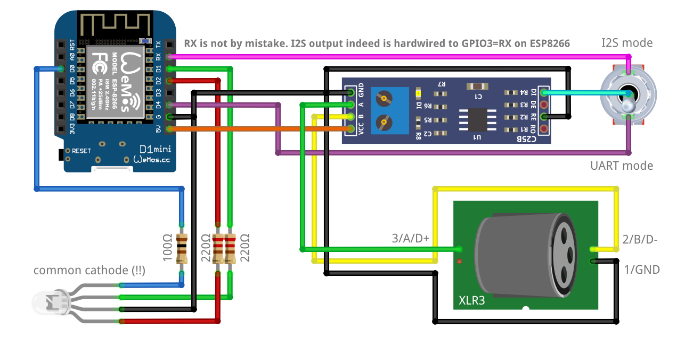

# Overview

This sketch implements a WiFi module that uses the Art-Net protocol over a wireless connection to control wired stage lighting fixtures/lamps that are DMX512 compatible. It listens to incoming Art-Net packets and forwards a single universe to DMX512. It features over-the-air (OTA) configuration of the wifi network that it connects to, configuration of the universe that is forwarded, and monitoring of the incoming packets and the frame rate.

Upon switching on, the LED turns yellow to indicate that setup is done. After that the LED turns red to indicate that it is not connected to WiFi. It will try connect as client to the previously used WiFi network; if that succeeds, the LED turns green and setup is ready. If that fails, the LED remains red and the node creates a wireless access point (AP) with the name Artnet. You can connect with laptop or smartphone to that network to configure the WIFi client settings and provide the password of the network to which it should connect. After that it resets.

Wherever there is activity on the web interface (configuration, monitoring), the LED turns blue. During web interface activity, the DMX512 output is silenced. A smooth web interface and smooth DMX signalling don't go together.

See http://robertoostenveld.nl/art-net-to-dmx512-with-esp8266/ for more details and photos, and https://robertoostenveld.nl/timing-and-jitter-in-dmx512-signals/ for a detailled look at the timing of the DMX signals.

# Operating modes

## UART

DMX is a serial protocol and - except for different voltage levels - very similar to RS232. Therefore it is obvious to use the built-in UART (Universal Asynchronous Receiver/Transmitter)
of the micro controller to send the DMX frames. This is the original way this sketch used to work and expects the max485 level shifter to be connected to the pin that corresponds to Serial1.
On a Wemos D1 this is pin D4 aka TX1. In order to use UART mode, comment in the ENABLE_UART definition.

## I2S

However, the built-in UART provides only very limited control over e.g. number of stop bits, breaks etc. That may become a problem when you want to control devices with kind of "sloppy" firmware. When trying to control two cheap, china made moving heads, I found that they somehow reacted to the signal but showed lots of jitter and random moves, random color changes and so on.
When connected to a commercial, manual DMX512 control panel, they worked flawlessly. An analysis with an oscilloscope showed a significant difference between the signal and the offical DMX
standard, most obviously in the number of stop bits. The DMX standard defines 2 stop bits whereas the commercial panel sent approx. 11 bits.
It seems like the manufacturers of such panels are aware of the fact that there are devices which apparently need more time between two DMX channel values to process the data received.

Because the buil-in UART does not allow to send more than 2 stop bits, the I2S mode (https://en.wikipedia.org/wiki/I%C2%B2S) has been implemented that supports very fine-grained control over
the timing of every single bit. Unfortunately, the I2S data output pin is hardwired to GPIO3 (=RX0) on an ESP8266 which means that the max485 level shifter needs to be attached to this pin.
Using a double throw switch allows to switch between those two pins as depicted in the wiring schematic below.

*Warning*: When uploading your this sketch to your ESP8266, make sure to disconnect any fixtures from the XLR connector because this means sending data to RX0 and will cause your
fixtures to do random things. This might not be a big problem with simple lamps but might cause damage when using motion devices.

You can just as well use two max485 circuits and wire one to TX1/D4 and the second one to RX0 and comment in both modes (ENABLE_UART and ENABLE_I2S).

Because of the number of extra stop bits, I2S mode will cause the throughput to drop from 40 frames/second to approx. 30 f/s which still should be acceptable under normal circumstances.

For I2S mode, there is another conditional define (I2S_SUPER_SAFE) which not only adds extra stop bits but also extends the MBB (mark before break) and SFB (space before break)
to the values observed with the oscilloscope. Try this if you encounter problems with a fixture although you are already using I2S mode.

## Standalone mode

Normally you would configure your Art-Net device to connect to your local WiFi after you uploaded this sketch (_and_ the static content! - see notes below).
To do so, you will connect to the AP (access point) network the ESP8266 creates after booting for the first time.
But there might be circumstances where you do not have access to a local WiFi network, for instance an outdoor garten pary.
This is what the standalone mode is for. In standalone mode the sketch will not wait until a local WiFi connection was established but will start to listen for Art-Net packets
right away on the AP network. You can then connect to this network, ignore/minimize the WiFi setup dialog and send your Art-Net packets to the corresponding network interface.

Consider setting also a password in standalone mode, otherwise someone else might configure your device to connect to a random Wifi.

# Components

  - Wemos D1 mini
  - MAX485 module, e.g. http://ebay.to/2iuKQlr
  - DC-DC boost/buck converter 5V power supply, e.g. http://ebay.to/2iAfOei
  - common cathode RGB LED
  - 2x 220 Ohm and 1x 100 Ohm resistors
  - 3 or 5 pin female XLR connector
  - panel mount 2.1 x 5.5 mm DC barrel jack
  - 82 x 58 x 34 mm ABS enclosure box
  
  Optional for I2S mode:
  
  - an SPDT (single pole double throw) switch OR
  - an extra MAX485 module and XLR connector

# Wiring scheme

## 5V power and GND
- connect 5V and GND from the power supply to Vcc and GND of the MAX485 module
- connect 5V and GND from the power supply to the 5V and GND of the Wemos D1 mini

## MAX485
- connect MAX485 module pin DE (data enable)    to 3.3V (using 3.3V TTL)
- connect MAX485 module pin RE (receive enable) to GND
- connect MAX485 module pin DI (data in)        to D4/TX1   of the Wemos D1 mini for UART operation
- connect MAX485 module pin DI (data in)        to RX/GPIO3 of the Wemos D1 mini for I2S operation
- connect MAX485 module VCC   to 3.3V (or to DE)
- connect MAX485 module pin A to XLR 3
- connect MAX485 module pin B to XLR 2
- connect MAX485 module GND   to XLR 1

## RGB LED
- connect the blue  leg of the LED over the 100 Ohm resistor to GPIO16/D0
- connect the green leg of the LED over the 220 Ohm resistor to GPIO05/D1
- connect the red   leg of the LED over the 220 Ohm resistor to GPIO04/D2

## SPIFFS for static files

You should not only write the firmware to the ESP8266 module, but also the static content for the web interface. The html, css and javascript files located in the data directory should be written to the SPIFS filesystem on the ESP8266. See for example http://esp8266.github.io/Arduino/versions/2.0.0/doc/filesystem.html and https://www.instructables.com/id/Using-ESP8266-SPIFFS for instructions.

You will get a "file not found" error if the firmware cannot access the data files.

## Arduino ESP8266 filesystem uploader

This Arduino sketch includes a `data` directory with a number of files that should be uploaded to the ESP8266 using the [SPIFFS filesystem uploader](https://github.com/esp8266/arduino-esp8266fs-plugin) tool. At the moment (Feb 2024) the Arduino 2.x IDE does *not* support the SPIFFS filesystem uploader plugin. You have to use the Arduino 1.8.x IDE (recommended), or the command line utilities for uploading the data.
