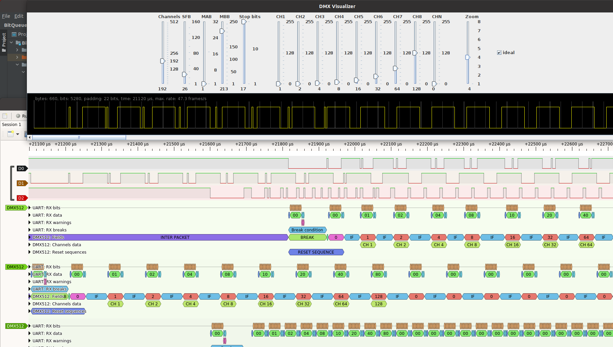
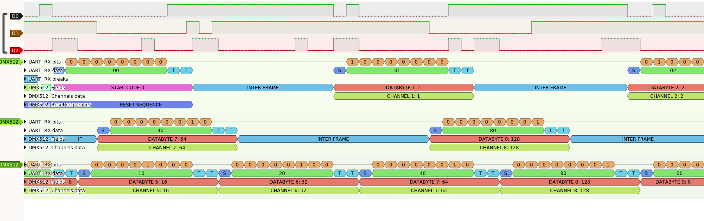

# DMX timing

This folder contains some documentation and explanation of DMX signal
timings and a tool to compute and visualize a configuration for specific
needs.

DMX uses a standard 8N2 byte encoding with 1 start bit (low), 8 data bits
(LSB first) and 2 stop bits (high) and sends repeatedly and continuously a 
block of up to 512 bytes over a serial RS-485 line at a rate of 250.000 bits/s.
The whole block is called a DMX packet and the single bytes lock are referred 
to as "frames" or "slots". Every frame corresponds to a DMX channel except for the
first at index 0 which normally has a value of 0 and is called the start byte.

Besides this, the DMX standard defines breaks and gaps beween the packets
as well as the frames. A good explanation can be found here: 
https://www.erwinrol.com/page/articles/dmx512

When trying to control a cheap, china made moving head fixture with this
sketch in UART mode, it turned out that this device principally reacted to the 
DMX signal, however showed many small random moves, jitter and unpredictable 
changes in color, strobe etc.

By contrast, when attached to a commercial "computer lamp table controller" 
or DMX512 controller, the reaction was absolutely as expected and smooth.

A comparison of the signals with an oscilloscope and a logic analyzer showed
a significant difference in the timing parameters. Most obviously there was
a long (60 μs) high signal after the last stop bit.
This can be considered as many extra stop bits or an interframe break,
also referred to as "mark time between slots".

The following image shows a comparison of the signal of the commercial
controller (D0), the original implementation using the micro controller's 
UART (D2) and the signal using the I2S mode (D1).
Timing parameters of the last one were chosen for this comparison to match
the signal of the commercial controller as close as possible.

# 

Using I2S and almost these timing parameters, the problematic fixture worked 
flawlessly. However, because of the extremely long breaks and marks, the 
overall throughput dropped from 40 packets/s to below 30.

Experimenting a little bit with these parameters showed that the number of
stop bits and the length of the "space for break" were the game changers.
The fixture needed at least 44 μs and 3 stop bits to work smoothly. 

The following image shows a drill into the aforementioned signals where it
becomes apparent that using the UART, there will be no interframe break at
all and is also impossible to implement, because the microprocessors's
hardware does not allow to send more than 2 stop bits.

# 
 

